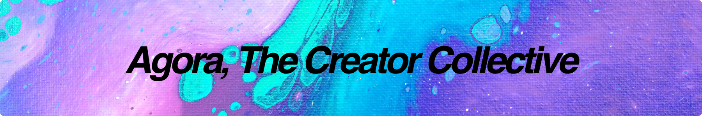

# Agora



[Swarms is brought to you by Agora, the open source AI research organization. Join Agora and Help create swarms and or recieve support to advance Humanity. ](https://discord.gg/qUtxnK2NMf)

# VisualNexus

[](https://github.com/kyegomez/VisualNexus/blob/main/LICENSE)
[](https://github.com/kyegomez/VisualNexus/stargazers)
[](https://github.com/kyegomez/VisualNexus/issues)
[](https://github.com/kyegomez/VisualNexus/pulls)

VisualNexus is an open-source training pipeline designed to facilitate the segmentation and labeling of visual datasets using a single model. It allows you to generate richly detailed labeled datasets for downstream fine-tuning of models. With VisualNexus, you can streamline the process of data preparation and enhance the efficiency of training computer vision models.


## Getting Started

To get started with VisualNexus, please follow the introductary instructions below or at the bottom.

1. Clone the VisualNexus repository:

```bash
git clone https://github.com/kyegomez/VisualNexus.git
cd VisualNexus
```

2. Install the required dependencies:

```bash
pip install -r requirements.txt
```

3. `cd VisualNexus` then `cd models`

4. Enter in your dataset in either `sag_img.py` and `sag_video.py`

5.

```bash
python3 sag_img.py
```

5. The labeled dataset will be stored in the specified output folder, ready for downstream fine-tuning.

## Key Features

- Seamless segmentation and labeling of visual datasets.
- Efficient data preprocessing and augmentation techniques.
- Support for multiple input data formats.
- Richly detailed labeled datasets for downstream model training.
- Easy integration with existing computer vision workflows.
- Share with friends feature to spread awareness across various social media platforms.

## Architecture

VisualNexus employs a simple yet effective architecture to perform segmentation and labeling tasks. The pipeline consists of the following steps:

1. **Data Input**: VisualNexus accepts input visual datasets in various formats, including images, videos, or any other compatible data format.

2. **Segmentation and Labeling**: The dataset is processed using a pre-trained segmentation model, which accurately identifies and segments objects or regions of interest within the visuals. This step produces richly detailed labels for each data instance.

3. **Dataset Storage**: The labeled dataset is stored in a structured format, ensuring the preservation of original data along with the corresponding segmentation and labeling information. This format facilitates easy integration with downstream model training processes.

4. **Downstream Fine-tuning**: The generated labeled dataset can be seamlessly used for fine-tuning other computer vision models. The labeled data provides valuable annotations, enabling the models to learn from high-quality labeled examples and improve their performance.


## Detailed Instructions:

**For Images Only**

If you are looking to use VisualNexus for only images, the `SAG_IMG` class is suitable for this purpose. Follow these steps:

1. Import the `SAG_IMG` class from `visualnexus.py`:
```python
from visualnexus import SAG_IMG
```
2. Create an instance of `SAG_IMG` with the necessary parameters. These parameters include the paths to your images, model parameters, and optional settings. Below is an example:
```python
image_file_paths = load_hf_dataset(dataset_name="your_dataset") # Replace "your_dataset" with your dataset's name
img_seg = SAG_IMG(image_file_paths)
```
3. Call the `segment` method on the `SAG_IMG` instance to perform the segmentation:
```python
img_seg.segment()
```
4. If you want to save the resulting dataset, call the `create_dataset` method:
```python
img_seg.create_dataset()
```

**For Videos Only**

If you are dealing with videos, the `SAG_VID` class can be used. Follow these steps:

1. Import the `SAG_VID` class from `visualnexus.py`:
```python
from visualnexus import SAG_VID
```
2. Create an instance of `SAG_VID` with the necessary parameters. These parameters include the paths to your videos, model parameters, and optional settings. Below is an example:
```python
video_file_paths = load_hf_dataset(dataset_name="your_dataset") # Replace "your_dataset" with your dataset's name
vid_seg = SAG_VID(video_file_paths)
```
3. Call the `segment` method on the `SAG_VID` instance to perform the segmentation:
```python
vid_seg.segment()
```
4. If you want to save the resulting dataset, call the `create_dataset` method:
```python
vid_seg.create_dataset()
```

**For Both Images and Videos**

If your dataset contains both images and videos, the `SAG_MEDIA` class can be used. Follow these steps:

1. Import the `SAG_MEDIA` class from `visualnexus.py`:
```python
from visualnexus import SAG_MEDIA
```
2. Create an instance of `SAG_MEDIA` with the necessary parameters. These parameters include the paths to your images and videos, model parameters, and optional settings. Below is an example:
```python
image_file_paths = load_hf_dataset(dataset_name="your_dataset") # Replace "your_dataset" with your dataset's name
video_file_paths = load_hf_dataset(dataset_name="your_dataset") # Replace "your_dataset" with your dataset's name
media_seg = SAG_MEDIA(image_file_paths, video_file_paths)
```
3. Call the `segment` method on the `SAG_MEDIA` instance to perform the segmentation:
```python
media_seg.segment()
```
4. If you want to save the resulting dataset, call the `create_dataset` method:
```python
media_seg.create_dataset()
```

Now your dataset is ready for downstream tasks like model fine-tuning. Please note that you will need to replace `"your_dataset"` with the actual name of your dataset when loading the images and videos.

For more details, please refer to the documentation in the `visualnexus.py` script. The script is designed to be flexible and customizable, so feel free to modify it according to your needs.


## Share with Friends

Help us spread awareness about VisualNexus by sharing it on various social media platforms:

- [Twitter](https://twitter.com/intent/tweet?text=Check%20out%20VisualNexus%2C%20an%20open-source%20training%20pipeline%20for%20visual%20dataset%20segmentation%20and%20labeling.%20%23VisualNexus%20%23OpenSource%20%23MachineLearning%20%23ComputerVision%20%23DataScience&url=https%3A%2F%2Fgithub.com%2Fkyegomez%2FVisualNexus)

- [LinkedIn](https://www.linkedin.com/shareArticle?mini=true&url=https%3A%2F%2Fgithub.com%2Fkyegomez%2FVisualNexus&title=VisualNexus%20-%20Open-Source%20Training%20Pipeline%20for%20Visual%20Dataset%20Segmentation%20and%20Labeling&summary=Check%20out%20VisualNexus%2C%20an%20open-source%20training%20pipeline%20for%20visual%20dataset%20segmentation%20and%20labeling.&source=)

- [Facebook](https://www.facebook.com/sharer/sharer.php?u=https%3A%2F%2Fgithub.com%2Fkyegomez%2FVisualNexus)

- [Reddit](https://www.reddit.com/submit?url=https%3A%2F%2Fgithub.com%2Fkyegomez%2FVisualNexus&title=VisualNexus%20-%20Open-Source%20Training%20Pipeline%20for%20Visual%20Dataset%20Segmentation%20and%20Labeling)

- [WhatsApp](https://api.whatsapp.com/send?text=Check%20out%20VisualNexus%2C%20an%20open-source%20training%20pipeline%20for%20visual%20dataset%20segmentation%20and%20labeling.%20%23VisualNexus%20%23OpenSource%20%23MachineLearning%20%23ComputerVision%20%23DataScience%0A%0Ahttps%3A%2F%2Fgithub.com%2Fkyegomez%2FVisualNexus)

- [Telegram](https://t.me/share/url?url=https%3A%2F%2Fgithub.com%2Fkyegomez%2FVisualNexus&text=Check%20out%20VisualNexus%2C%20an%20open-source%20training%20pipeline%20for%20visual%20dataset%20segmentation%20and%20labeling.)

- [Pinterest](https://pinterest.com/pin/create/button/?url=https%3A%2F%2Fgithub.com%2Fkyegomez%2FVisualNexus&description=Check%20out%20VisualNexus%2C%20an%20open-source%20training%20pipeline%20for%20visual%20dataset%20segmentation%20and%20labeling.)


- [Hacker News](https://news.ycombinator.com/submitlink?u=https%3A%2F%2Fgithub.com%2Fkyegomez%2FVisualNexus&t=VisualNexus%20-%20Open-Source%20Training%20Pipeline%20for%20Visual%20Dataset%20Segmentation%20and%20Labeling)

- [Weibo](http://service.weibo.com/share/share.php?url=https%3A%2F%2Fgithub.com%2Fkyegomez%2FVisualNexus&title=VisualNexus%20-%20Open-Source%20Training%20Pipeline%20for%20Visual%20Dataset%20Segmentation%20and%20Labeling&pic=&searchPic=false)

Let's share VisualNexus and help the community benefit from this open-source training pipeline for visual dataset segmentation and labeling!

## Contributing

Contributions are welcome! If you have any ideas, suggestions, or bug reports, please feel free to open an issue or submit a pull request.

## License

This project is licensed under the [MIT License](https://github.com/kyegomez/VisualNexus/blob/main/LICENSE).

## Acknowledgements

We would like to express our gratitude to the open-source community for their invaluable contributions and inspiration.

## Contact

Email kye at kye@apac.ai


# 2 Pipelines
2 potential pipelines, what do you think? We should make one for robotic datasets

* Infinigen -> Segment Anything Video -> Very Rich and Detailed Dataset.

* Segment Anything for Image and or Video -> Iterate over Dataset and segment-> Very Rich and Detailed Dataset structured dataset for pretraining?

* Video Pipeline [vidoe instruction dataset ](https://llavar.github.io/) -> Segment Anything Video -> Orca-Like explain your reasoning instruction tuning creation -> super SOTA visual pretraining dataset for vision models

* from discord chat in LAION with Christop

```
*"This looks wonderful
reclaimer — Today at 7:33 AM
We could make like an multi modal dataset with images or video dataset like Orca’s where the model explains its multi modal reasoning 
Christoph — Today at 10:13 AM
Yes, exactly. Or we take lavar captions and Feed them in GPT 4 to reason based on the Text about the Image contents, the causes, consequeces.... 😉
reclaimer — Today at 11:41 AM
We could also sprinkle in video segment anything to show the model the segmentations with detailed reasoning explanations"
```

# Roadmap

* Creaet documentation for all classes

* Create examples for Robotic Vision, Medical Imaging, Autonomous Driving, Satellite Imagery:


* Update examples